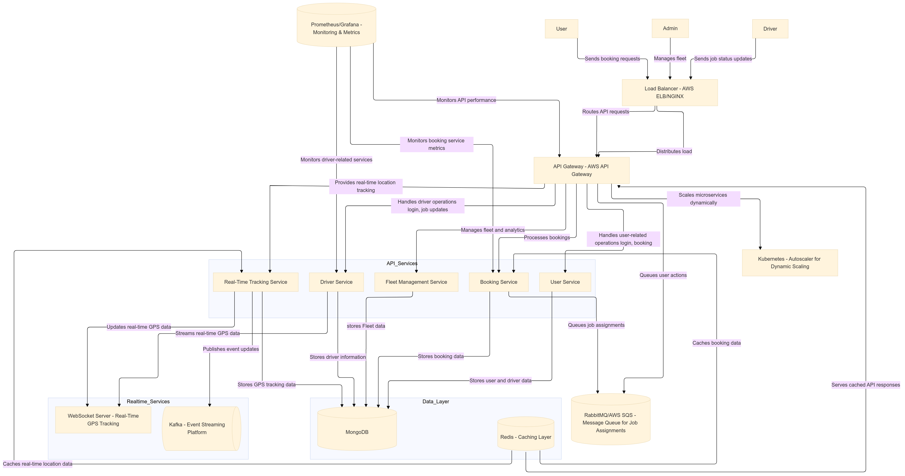

# Logistics Platform: Design Decisions, Scalability, and High-Performance Handling

## Overview

This logistics platform is designed to manage up to **50 million users**, **100,000 drivers** globally, and handle **10,000 requests per second**. The architecture focuses on scalability, high-performance real-time data handling, and efficient traffic management.

## Table of Contents

1. [Major Design Decisions and Trade-offs](#1-major-design-decisions-and-trade-offs)
   - [Microservices Architecture](#microservices-architecture)
   - [Data Storage: MongoDB and Redis](#data-storage-mongodb-and-redis)
   - [Real-Time Data Handling: WebSockets and Kafka](#real-time-data-handling-websockets-and-kafka)
2. [Managing High-Volume Traffic](#2-managing-high-volume-traffic)
   - [Horizontal Scaling with Kubernetes](#horizontal-scaling-with-kubernetes)
   - [Load Balancing with AWS ELB and NGINX](#load-balancing-with-aws-elb-and-nginx)
3. [Distributed Data Handling](#3-distributed-data-handling)
   - [Caching with Redis](#caching-with-redis)
   - [Geospatial Indexing with MongoDB](#geospatial-indexing-with-mongodb)
   - [Eventual Consistency and Asynchronous Writes](#eventual-consistency-and-asynchronous-writes)
4. [User Interface](#4-user-interface)
5. [System Architecture](#5-system-architecture)
6. [ER Diagram](#6-er-diagram)
7. [Conclusion](#7-conclusion)

## 1. Major Design Decisions and Trade-offs

### Microservices Architecture

The platform is built using a **microservices architecture** where core services such as User Management, Driver Management, Booking, Fleet Management, and Real-Time Tracking are separated. This allows:

- Independent scaling of services based on demand.
- Modular development, easier to maintain and deploy.

**Trade-offs:**  
Microservices increase complexity in service communication, coordination, and data consistency. We employ **eventual consistency** for non-critical data (e.g., location updates) and **strong consistency** for critical data (e.g., bookings, payments).

### Data Storage: MongoDB and Redis

- **MongoDB** is used as the primary database for handling large and dynamic datasets such as user profiles, driver information, and real-time GPS data.
- **Redis** is used for caching frequently accessed data (e.g., booking statuses, driver locations) to reduce load on MongoDB and improve performance.

**Trade-offs:**  
MongoDB's flexible schema allows it to handle large datasets but can experience performance issues under heavy write loads. Redis mitigates this by caching frequently requested data, improving system responsiveness during peak traffic.

### Real-Time Data Handling: WebSockets and Kafka

- **WebSockets** enable low-latency, bi-directional communication for real-time data such as GPS tracking and status updates, reducing repetitive HTTP requests.
- **Kafka** is used for event streaming to handle high-frequency events like job assignments and GPS location updates.

**Trade-offs:**  
WebSockets require robust error-handling for network interruptions, and Kafka adds infrastructure complexity to maintain event delivery guarantees.

## 2. Managing High-Volume Traffic

### Horizontal Scaling with Kubernetes

The platform is horizontally scalable using **Kubernetes**, allowing microservices to scale independently. Kubernetes dynamically adjusts the number of service instances based on real-time traffic, ensuring:

- **Dynamic Scaling:** Handles peak traffic by provisioning additional instances during high-demand periods and scaling down during off-peak times.

### Load Balancing with AWS ELB and NGINX

Traffic is distributed across service instances using **AWS Elastic Load Balancer (ELB)** and **NGINX**:

- **Regional Load Distribution:** Traffic is routed to the nearest server based on the user’s location, reducing latency and improving response times.

## 3. Distributed Data Handling

### Caching with Redis

Frequently accessed real-time data like GPS locations and booking statuses are cached in **Redis** for fast retrieval. This reduces the load on MongoDB, improving performance during high-traffic periods.

### Geospatial Indexing with MongoDB

MongoDB’s **geospatial indexing** is used to efficiently query GPS data, enabling features like nearby driver search and real-time vehicle tracking.

- **Partitioning and Sharding:** MongoDB partitions data (e.g., by geographic region or driver ID) to distribute the load across multiple servers, improving query performance and scalability.

### Eventual Consistency and Asynchronous Writes

For non-critical operations (e.g., frequent GPS updates), the platform uses **eventual consistency** and **asynchronous writes** to MongoDB. This ensures real-time responsiveness without overwhelming the database.

**Trade-offs:**  
While this approach improves user-facing performance, it requires careful management to avoid discrepancies between services during asynchronous writes.

## 4. User Interface

The platform provides a user-friendly interface with the following key features:

1. **Set Pickup** – Users can select their pickup location.
2. **Set Drop and Confirm** – Users can set the drop location and confirm the booking.
3. **Delivery Man Assigned** – Real-time WebSocket connection between the user and driver is established.
4. **Regular Updates** – Users receive regular updates on the delivery status.
5. **Driver View** – Drivers can track shipped orders in real-time.

## 5. System Architecture

Here is the high-level system architecture of the platform:

This architecture highlights the microservices design, communication protocols (WebSockets, APIs), and the use of horizontal scaling with Kubernetes.

## 6. ER Diagram

The following ER Diagram represents the key entities and relationships within the logistics platform:

## 7. Conclusion

The logistics platform is architected to handle large-scale global operations while ensuring high performance, low latency, and scalability. By leveraging **microservices architecture**, **distributed data handling** with MongoDB and Redis, and **horizontal scaling** with Kubernetes, the platform can manage high traffic, real-time interactions, and data storage efficiently.

**Key Trade-offs:**  
The platform balances **eventual consistency** vs. **strong consistency** to maintain a robust and reliable system capable of handling real-time logistics operations on a global scale.
